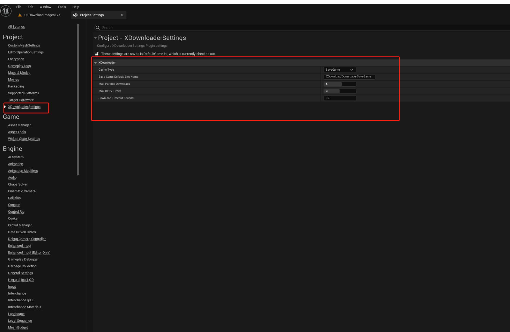
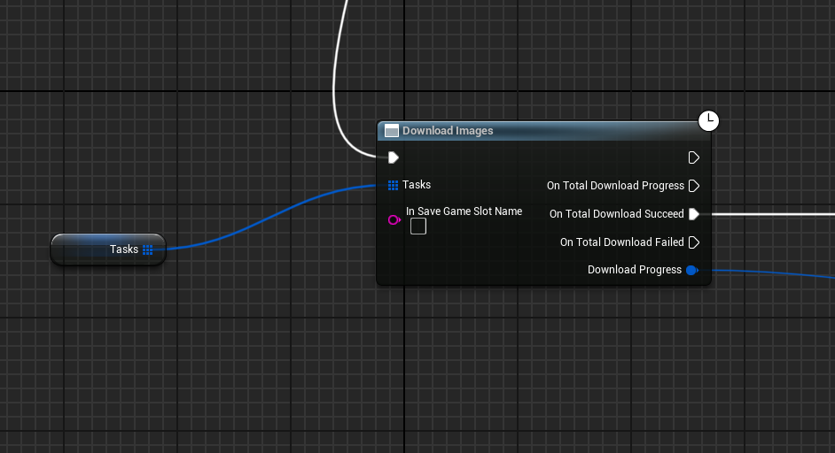
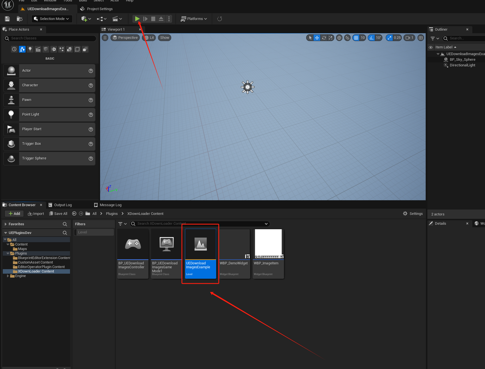

# UEDownloadImages

## Background and Problem Solved

This plugin addresses a specific issue in Unreal Engine: the `DownloadImage` node cannot be directly called multiple times in a loop, and subsequent calls overwrite previous results. Additionally, this node lacks caching functionality.

Although real-time downloading is common in game development, this plugin is crucial for scenarios requiring caching, or simultaneous downloading of multiple images followed by additional processing. It's an ideal choice for any Unreal Engine application aiming to enhance user experience through caching.

The plugin significantly saves time by eliminating complex programming required for implementing parallel downloading and caching functionalities.

## Features

- **Extension**: Solves the issue of overlapping results due to the inability to call the `DownloadImage` node multiple times in a loop.
- **Multiple Image Downloading**: The `DownloadImages` API allows users to download multiple images simultaneously, requiring an array of structures composed of image IDs and URLs.
- **Caching**: Implements image caching using Unreal Engine's `SaveGame` feature, preventing repeated downloads for the same image ID.
- **Customizable Settings**: Supports customized settings, such as default location for cached images, maximum number of parallel downloads, and caching methods.
- **Caching Methods**: Offers options to cache using `SaveGame`, local file caching, or both.
- **Simplicity**: Enables multiple image downloads with just a call to the `DownloadImages` blueprint node, no complex code required.
  

## Prerequisites

- Developed using Unreal Engine 5.3, ensure your project uses Unreal Engine version 5.3 or higher.
- **Note**: It is recommended to use the image's URL or the filename from the URL as the image ID for uniqueness and updateability.

## Compatibility

- Developed with Unreal Engine 5.3 and uses stable APIs common in Unreal, making it adaptable for Unreal 4 and higher versions of Unreal 5. Developers interested in supporting other versions are welcome to contribute.

## Example

- Open the `UEDownloadImagesExample` map in the plugin's `Content` directory, run the game, and click to see the effects. For specific calls, refer to `BP_UEDownloadImagesController` under `GameMode`.

## Feedback and Suggestions

- For additional feature requests or suggestions, please discuss in the issues section.

## Future Updates

- **Method Parameter Updates**: Add parameters in the `DownloadImages` method for whether to cache and the caching method, allowing real-time overrides of project settings.

## Application Scenarios

While not common in game development, this plugin quickly solves specific needs, particularly suitable for scenarios requiring downloading and managing multiple images.

# 背景和解决的问题

本插件针对虚幻引擎中的一个具体问题：`DownloadImage`节点无法在循环中被多次直接调用，且后续调用会覆盖之前的结果。此外，该节点也不支持缓存功能。

在游戏开发领域，虽然通常采取实时下载方式，但对于需要缓存的场景，或同时下载多张图片并在下载完成后执行其他操作的场景，本插件非常关键。对于任何希望通过缓存提升用户体验的虚幻引擎应用，这个插件也是一个理想选择。

本插件可以显著节省时间，免去实现并行下载和缓存功能的复杂编程工作。

## 功能

- **扩展**: 解决了`DownloadImage`节点在循环中无法多次调用导致的调用结果相互覆盖问题。
- **多图下载**: 通过`DownloadImages` API，用户可同时下载多张图片，需要输入由图片ID和URL组成的结构体数组。
- **缓存**: 使用虚幻引擎的`SaveGame`功能实现图片缓存，避免同一图片ID的重复下载。
- **自定义设置**: 支持定制化设置，如缓存图片的默认位置、最大并行下载数量和缓存方式。
- **缓存方式**: 可选择使用`SaveGame`或本地文件缓存，或两者同时使用。
- **简易操作**: 只需调用一个蓝图节点`DownloadImages`即可实现多图下载，无需编写复杂代码。

## 使用前提

- 本插件使用虚幻引擎5.3开发，确保项目使用虚幻引擎版本为5.3或更高。
- **注意**: 建议使用图片的URL或URL的文件名作为图片ID，以保证ID的唯一性和更新性。

## 兼容性

- 使用虚幻引擎5.3开发，易于修改以适应虚幻4和更高版本的虚幻5。对此有兴趣的开发者可参与添加其他版本支持。

## 示例

- 在插件的`Content`目录下打开`UEDownloadImagesExample`地图，运行游戏并点击运行，即可见效果。具体调用方法请参见`GameMode`下的`BP_UEDownloadImagesController`。

## 交流与建议

- 对插件有功能需求或建议，请在issues区留言讨论。

## 未来更新

- **方法参数更新**: 在`DownloadImages`方法中增加是否缓存的参数及缓存方式参数，可在调用时实时覆盖项目设置。

## 应用场景

虽不常见于游戏开发，本插件迅速解决特定需求，特别适用于需要下载和管理多张图片的场景。

